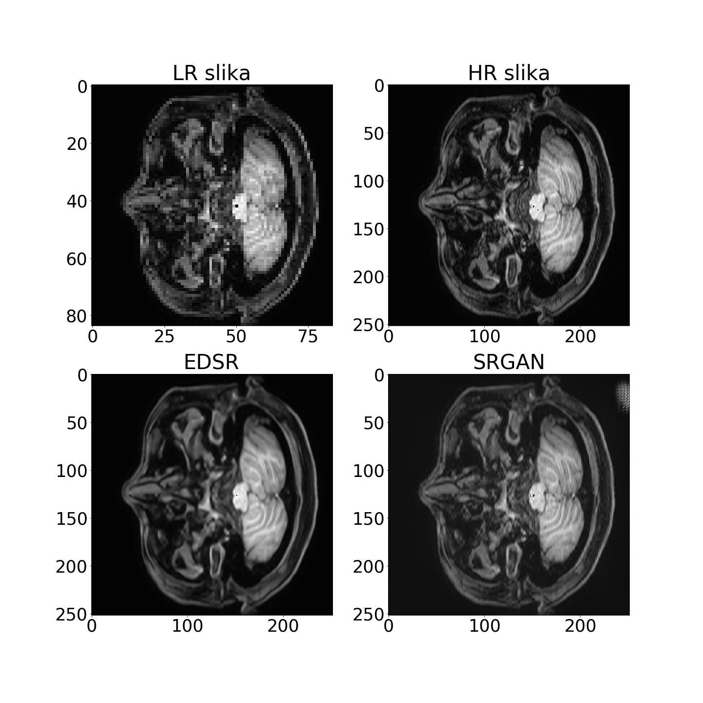
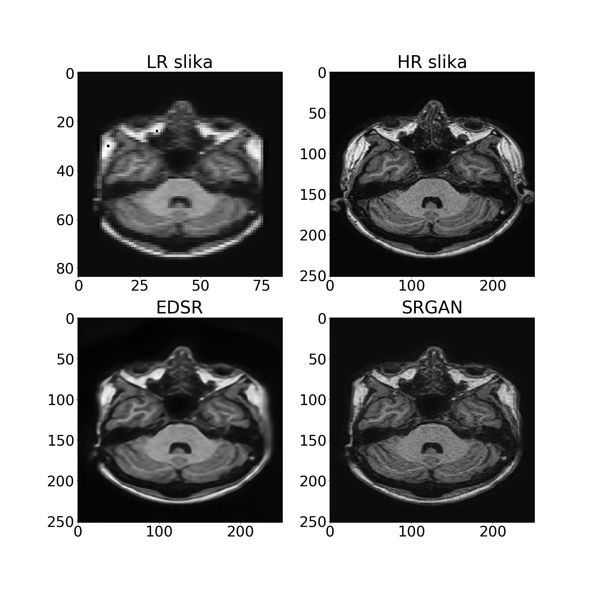

# MRI_image_super_resolution
During classes of Medical images analaysis in Faculty of Electrotehnic of University of Ljubljana, I tried to make super resolution model of MRI (Magnetic resonance imaging) with deep learning. I used source code from github (https://github.com/krasserm/super-resolution), which was modified form my aplication.
I used EDSR and SRGAN architectures for learning neural network. I lerned two models. One dataset was made artificial with high resolution image downgraded to get low resolution image pair. Second were real pairs of LR and HR images.

**On this Drive there are all neccesary folders, code, images etc.:
https://drive.google.com/drive/folders/1Kmn9bVfWjjyrB5lL8VHOV3vP3K134n3a?usp=sharing**

### What are folders for:
**real_images** -> 3D MR images of 182 patients. Every subfolder have 4 3D images one is HR (high resolution) with space sampling of 1x1x1mm. The other three are LR images which have 3mm space sampling along one axis (sagital, transversal and coronal).
**synthetic_images** -> 28 T1 MR images, 28 FLAIR MR images, 36 LR T1 MR images in 8 T1 raw LR MR images.
**dataset_MRI_real** -> This floder contains HR-LR real pairs (5000 image pairs). There is also prepared numpy array in dataset_split sub-folder, for learning the model (train and test data).
**dataset_MRI_synthetic** -> the same as previous folder except there are synthetic made HR-LR pairs (2000 image pairs)
**model** -> contains some useful functions for SRGAN model and resolving LR images with trained model
**validation** -> contain statistic data of validation on both data groups real and synthetic (PSNR and SSIM metrics)
**weights_SR** -> weights of models I trained.

### What are scripts for:
**data_preparation_synthetic.ipynb:** -> This notebook is used for extracting HR slices from 3D images stored in synthetic_images. It also contains making numpy array of data for training and testing.
**REALdata_preparation.ipynb:** -> This notebook is used for extracting HR-LR slices pairs from 3D images stored in dataset_MRI_real. It also contains making numpy array of data for training and testing.
**training_REAL_DATA.ipynb:** ->This notebook is used for training on prepared dataset stored in dataset_MRI_real. It contains both EDSR and SRGAN model.
**training_synthetic.ipynb:**->This notebook is used for training on prepared dataset stored in dataset_MRI_synthetic. It contains both EDSR and SRGAN model.
**VALIDATION.ipynb:** -> This notebook is used for validating on test data which are stored in dataset_MRI_real and dataset_MRI_synthetic.
**unzip_zip_file.ipynb:**-> Just useful notebook for zip/unzip files.

## Example of synthetic image pair reconstruction

## Example of real image pair reconstruction

